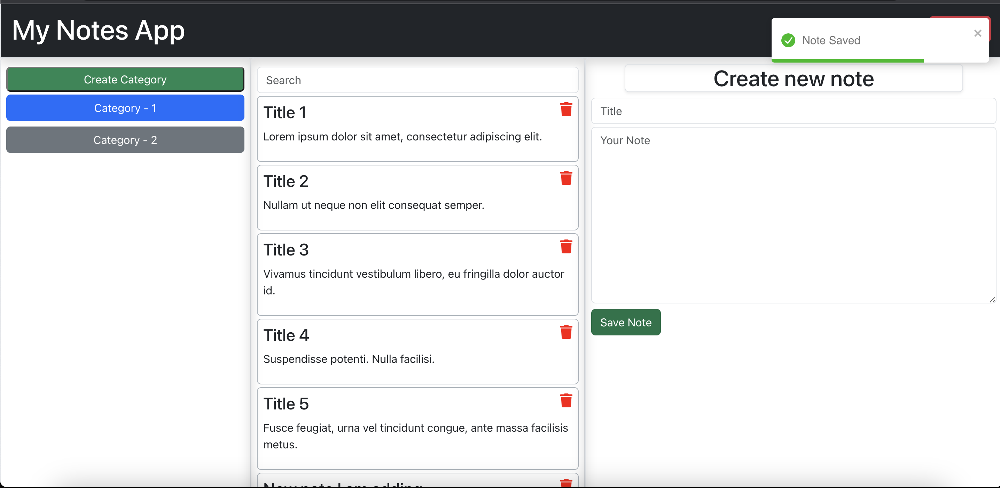
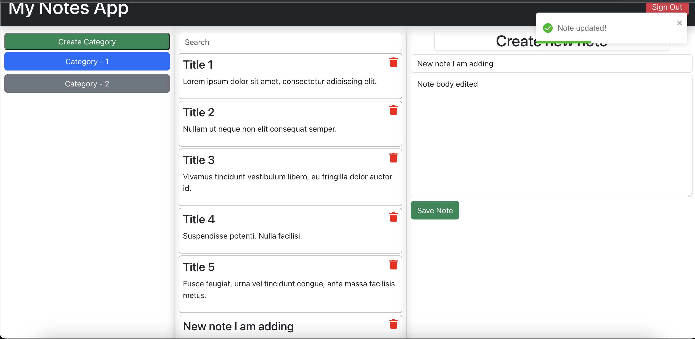
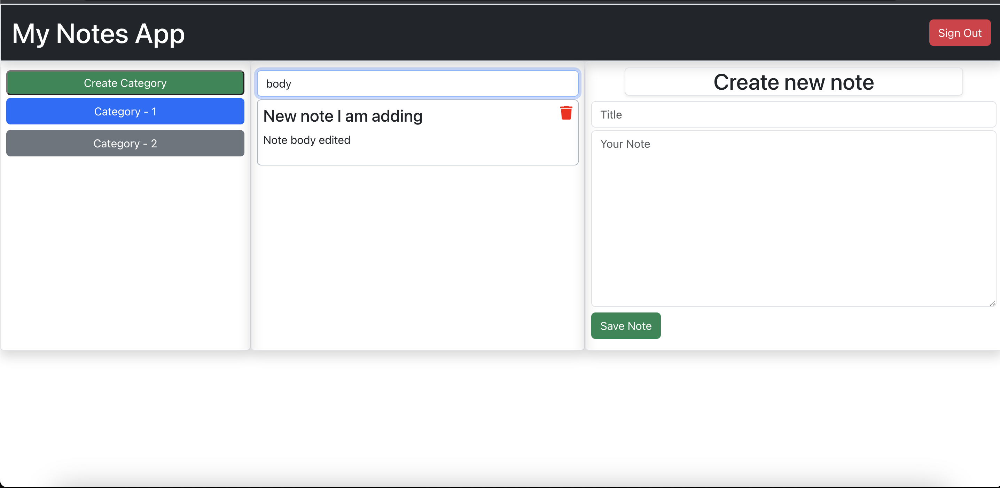
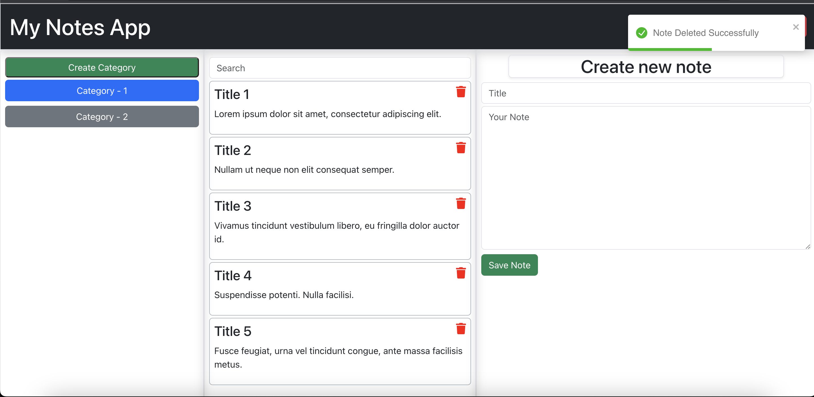
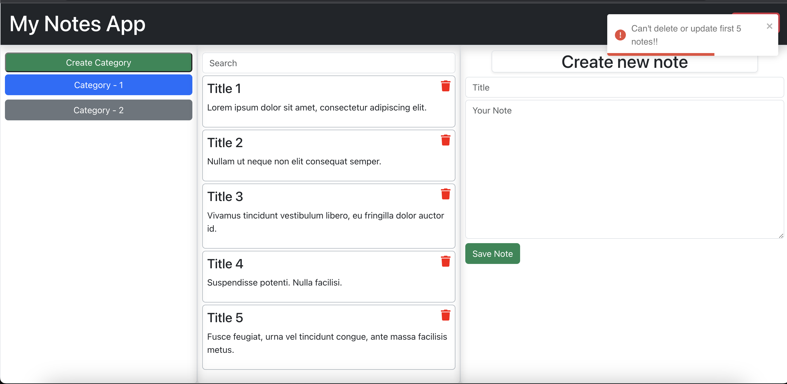
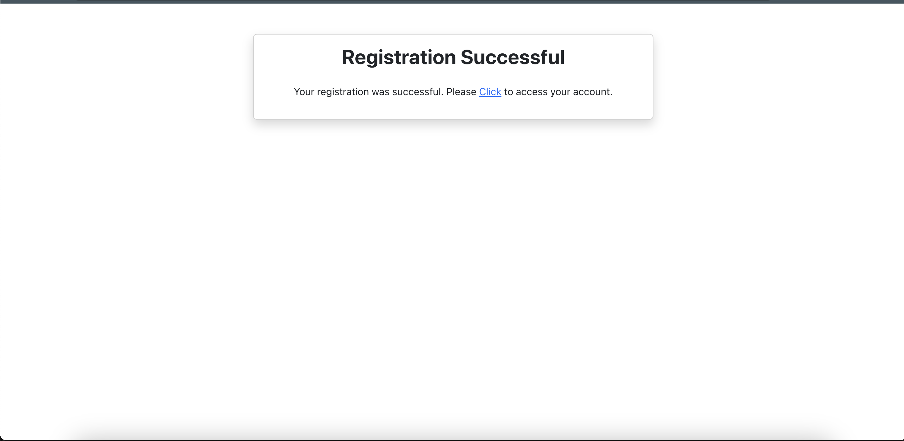
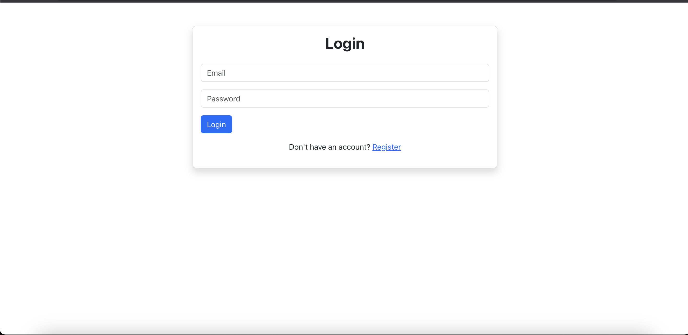
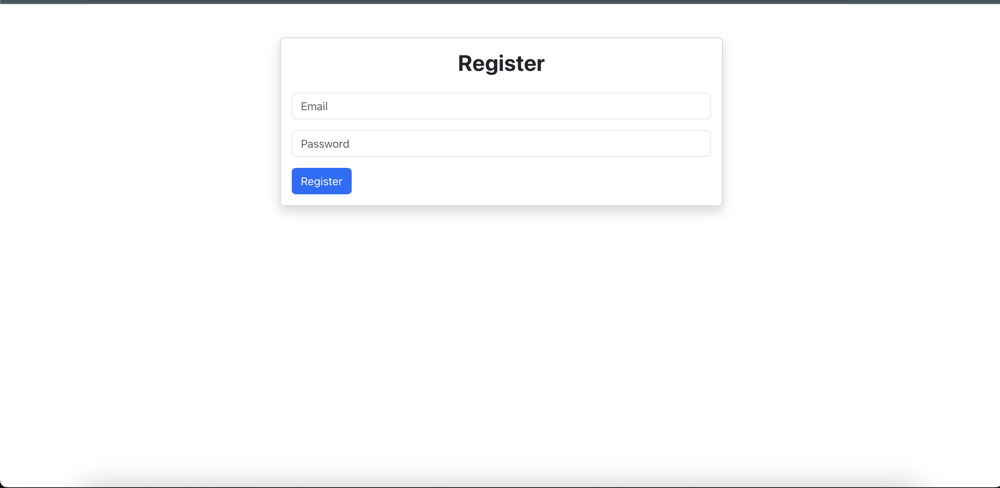

# My Notes App

A React-based web application where users can register, login, and manage their notes organized by categories.

## Features

- User Registration and Login with JWT Authentication.
- Create unlimited categories to organize your notes.
- Add as many notes as desired inside any category.
- Edit or delete your notes anytime.
- Logout from the application.

## Technologies Used

- React.js: Frontend library.
- MongoDB: Database to store users, categories, and notes.
- Express.js: Backend framework to handle API requests.
- Node.js: Runtime environment for executing JavaScript server-side.
- Axios: Promise based HTTP client for the browser and Node.js.
- React Router: For managing routes in the React application.
- Redux: For state management.
- JWT (JSON Web Tokens): For secure user authentication.
- React Toast: For displaying notifications.
- Bootstrap: UI framework for styling and components.

## Getting Started

### Prerequisites

- Make sure you have `Node.js` and `MongoDB` installed on your machine.

### Installation

1. Clone the repository:

```bash
git clone 
```

2. Install the necessary npm packages for the frontend:

```bash
cd [your repository name]
npm install
```

3. To run the frontend:

```bash
npm start
```

4. For the backend, navigate to the server directory and start the server:

```bash
cd server
node server.js
```
## Usage

1. Open the application in your browser, at `http://localhost:3002`.
2. Register as a new user or login if you've already registered.
3. Start creating categories and adding notes inside them. You can also edit or delete notes as required.
4. Logout from the application when done.

## Screenshots

Here's a look at the application:

|  |  |
| ---------------------------------- | ---------------------------------- |
|  |  |
|  |  |
|  |  |

## Enhancements & Scalability

### Security Enhancements

1. **Data Encryption**: Ensure end-to-end encryption for sensitive data during transmission and storage.
3. **API Protections**: Incorporate rate limiting and validate/sanitize input to prevent malicious activities.
5. **Infrastructure Defense**: Protect databases and critical endpoints from direct exposure to the internet.
6. **Dependency Management**: Regularly update dependencies to address known vulnerabilities.

### Scalability Strategies

1. **Database Strategies**: Implement effective indexing in MongoDB and consider sharding for larger loads.
2. **Caching**: Use caching systems like Redis to reduce direct database reads.
3. **Load Balancers**: Distribute incoming traffic across multiple app instances for balance.
4. **Utilize CDNs**: Serve static assets via Content Delivery Networks for reduced latency.
5. **Microservices**: Refactor into a microservices architecture to scale different functionalities independently.
6. **Optimized Queries**: Continuously optimize database queries for efficiency.


